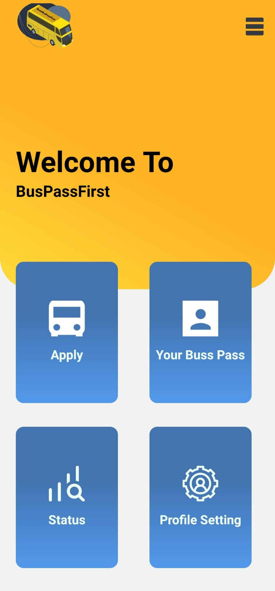

# BussPass
<h1>Abstract</h1>

Buss Pass App Aims to reduce the paper work and effort require to apply and generate the bus
pass for students of staffs. Role Based Access where students and apply for the bus pass while 
uploading receipt or prove that’s shows amount has been paid to avail the transportation
facility and can sent the request to the admi. Admin on the other side can review the request 
sent by the student and match their record by looking at their database or document file. If
everything is good, he can Approve the request and if something is wrong the he can Decline
the request and also give the note what went wrong. Students can track their application status, 
Reasons of Decline (if declined). If Application is approved Student will have auto generated 
Bus pass with QR code attached to it which can be used for further verification.

<h1>1.Introduction</h1>

Buss Pass App Aims to reduce the paper work and effort require to apply and generate the 
bus pass for students of staffs. Role Based Access where students and apply for the bus pass 
while uploading receipt or prove that’s shows amount has been paid to avail the 
transportation facility and can sent the request to the admi. Admin on the other side can 
review the request sent by the student and match their record by looking at their database or 
document file. If everything is good, he can Approve the request and if something is wrong 
the he can Decline the request and also give the note what went wrong. Students can track 
their application status, Reasons of Decline (if declined). If Application is approved Student 
will have auto generated Bus pass with QR code attached to it which can be used for further 
verification.

<h2>1.1 Login Screen</h2>

To use the Application user, have to login using the valid credentials, here roll number of 
the student is used and the username to uniquely identify the student and password can be 
anything with minimum length 6 character.

<h2>1.2Apply Screen</h2>
  It contains the already filled user details and shows the student before applying for bus pass. 
  It contains Upload Receipt feature though which student can upload receipt of fee paid for 
  availing bus facility directly from their phone. After verification student can click on apply 
  button and application will be sent to the admin for further process.
<h2>1.3 Profile Screen</h2>
  This Screen displays the user details and gives the option to update the user details as well 
  as user profile image which is used while applying for bus pass and auto generated bus pass.
<h2>1.4 Status Screen </h2>
  This screen helps user to track the application status submitted for bus pass. If bus pass is 
  approved it will let user know and if the bus pass is decline and a reason for decline is 
  attached to it, it will let user know the reason as well, then user can make correction and 
  apply again.
<h2>1.5 Bus Pass Screen</h2>
  This Screen contains Auto generated Bus pass of the user containing all the information of 
  the user with a QR Code. This QR code can be scanned with any QR Code scanning feature. 
  This code contains user details which cannot be altered as it is directly coming from the 
  serve which can be used to cross verify the user.
<h2>1.6 Student List Screen</h2>
  This screen shows all the students list applied for bus pass and can look at the details of 
  single request as well and then perform necessary action can approve the request of decline 
  the request. This screen also contains filter to filtered application based the branch and 
  semester of the student applied for the bus pass.
<h2>1.6 Approval/Decline Screen</h2>
This Screen is for Admin where Admin can track the application which have approved or 
declined by him.
